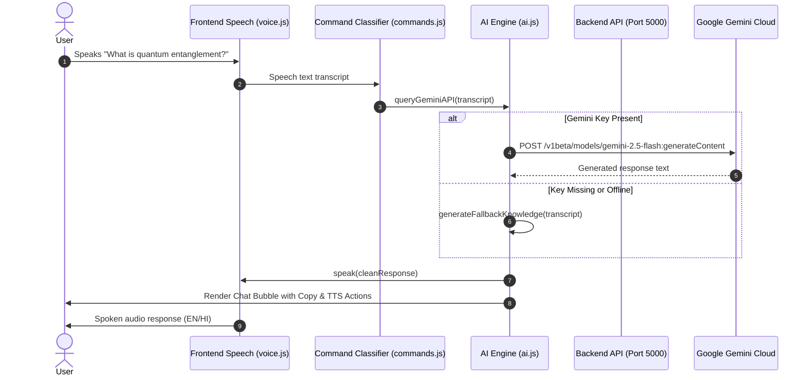
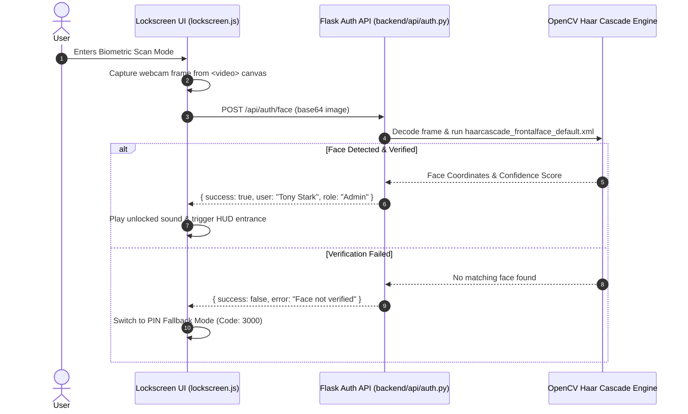

# 🏛️ J.A.R.V.I.S. AI OS — Architecture & System Design Specification

This document provides the complete multi-tiered architecture, communication flows, component boundaries, execution pipelines, design systems, and security specifications for **J.A.R.V.I.S. AI OS v3.2.0**.

---

## 🏗️ 1. High-Level Multi-Tier Architecture

```mermaid
graph TD
    User([👤 User: Voice / Text / Camera / Mouse])

    subgraph PresentationTier["🖥️ Presentation Tier: Tactical Web HUD (Port 8080)"]
        UI["Glassmorphic Tactical HUD (index.html)"]
        ArcCore["Arc Reactor State Engine (arc.js / reactor3d.js)"]
        VoiceEngine["Bilingual Web Speech STT / TTS (voice.js)"]
        ImageGen["Pollinations AI 4K Flux Engine (ai.js)"]
        AuthTerminal["Tactical Auth Terminal / WebGL Shader (auth.html)"]
        ThemeEngine["Dynamic 360° Theme Controller (themes.css / settings.js)"]
    end

    subgraph ApplicationTier["⚙️ Application Tier: Flask REST Microservices (Port 5000)"]
        Router["Flask REST Application Dispatcher (server.py)"]
        API_Auth["Biometric Face & Hybrid Auth (/api/auth)"]
        API_System["System Telemetry & Diagnostics (/api/system)"]
        API_AI["Google Gemini Cognitive Bridge (/api/ai)"]
        API_Code["Python Sandbox & Code Helper (/api/code)"]
        API_Chat["Conversation Store SQLite/JSON (/api/chat)"]
        API_Weather["Atmospheric Telemetry Resolver (/api/weather)"]
    end

    subgraph AgentTier["⚡ Native Agent Execution & Automation Tier (Local Engine)"]
        SystemMonitor["Hardware Telemetry Supervisor (psutil)"]
        OSControl["Windows Application & Power Supervisor"]
        BrowserBot["Playwright Headless Web Automation Engine"]
        MediaCtl["Media Player & Audio Stream Resolver"]
        ScreenProc["GDI Screen Capture & OCR Processing"]
    end

    subgraph CloudTier["🌐 External Cloud & Intelligence Tier"]
        GeminiCloud["Google Gemini API (2.5-flash / 2.0-flash / 1.5-flash)"]
        PollinationsAI["Pollinations AI Neural Flux & Flux-Anime (1024x1024)"]
        OpenMeteo["Open-Meteo Weather Telemetry Network"]
    end

    %% Presentation Tier Links
    User <-->|Speech / Clicks / Keyboard| UI
    UI <--> ArcCore
    UI <--> VoiceEngine
    UI -->|Image Generation Request| ImageGen
    UI <--> ThemeEngine
    ImageGen <--> PollinationsAI

    %% Presentation to Application Tier Bridge
    UI <-->|REST APIs / JSON Payloads / Base64| Router
    Router --> API_Auth
    Router --> API_System
    Router --> API_AI
    Router --> API_Code
    Router --> API_Chat
    Router --> API_Weather

    %% Application Tier to Agent & Cloud Bridges
    API_AI <--> GeminiCloud
    API_System --> SystemMonitor
    API_System --> OSControl
    Router --> BrowserBot
    Router --> MediaCtl
    Router --> ScreenProc
    API_Weather <--> OpenMeteo
```



---

## 🧩 2. Subsystem Deep-Dive

### 1. Presentation Tier (Tactical Web HUD — Port 8080)
* **Serving Mechanism**: Python static HTTP server (`http.server 8080`) bound to IPv4 loopback (`127.0.0.1`).
* **Visual Engine**: Vanilla HTML5/CSS3/JavaScript (ES6+ modular architecture) without heavy runtime framework overhead, guaranteeing <16ms frame times.
* **Arc Reactor Reactive State Machine**:
  * `STANDBY / IDLE`: Concentric rings rotate smoothly at 0.5 rad/s with cyan emission (`#00f0ff`).
  * `LISTENING`: Real-time audio waveform modulation using Web Audio Analyser nodes; emerald glow (`#00ff66`).
  * `THINKING / SYNAPSING`: Acceleration of opposing concentric matrix rings with violet glow (`#a855f7`).
  * `VOCALIZING / SPEAKING`: Amplitude-matched ripple pulses synchronized with TTS audio buffer output.
* **Bilingual Speech Engine**:
  * **STT**: Browser `webkitSpeechRecognition` supporting `en-IN`, `hi-IN`, and `en-US`.
  * **TTS**: Evaluates text for Devanagari script `[\u0900-\u097F]` or Hinglish vocabulary (`namaste`, `kaise`, `main`, `aapka`) to dynamically switch between Hindi speech engines and English OS voice profiles.

---

### 2. Application Tier (Flask REST Microservices — Port 5000)
* **Dispatcher**: Flask 3.x WSGI application with Cross-Origin Resource Sharing (`flask-cors`) enabled for `http://127.0.0.1:8080`.
* **Microservices Endpoints**:
  | Endpoint | Method | Component Blueprint | Functionality |
  | :--- | :--- | :--- | :--- |
  | `/` | `GET` | `server.py` | Health check, uptime diagnostics, and version verification |
  | `/api/auth/login` | `POST` | `backend/api/auth.py` | User authentication against hybrid local JSON / MongoDB store |
  | `/api/auth/face` | `POST` | `backend/api/auth.py` | Real-time OpenCV Haar Cascade biometric frame verification |
  | `/api/system/command` | `POST` | `backend/api/system.py` | Hardware telemetry (`psutil` CPU/RAM/Temp) and Windows automation |
  | `/api/code/helper` | `POST` | `backend/api/code.py` | Python sandbox runner with compiler returncode validation |
  | `/api/chat/history` | `GET/POST/DEL` | `backend/api/chat.py` | Message log retrieval, session persistence, and clear commands |
  | `/api/weather` | `POST` | `backend/api/weather.py` | Geolocation resolution and real-time atmospheric metrics |

---

### 3. Cognitive Intelligence & Image Generation Tier
* **Dual-Layer Cognitive Engine**:
  ```
  User Query ──► Check localStorage Gemini Key (AIzaSy...)
                     │
                     ├── [Valid Key Found] ──► Google Gemini REST Endpoint
                     │                           ├── Model: gemini-2.5-flash
                     │                           ├── Fallback 1: gemini-2.0-flash
                     │                           ├── Fallback 2: gemini-2.0-flash-lite
                     │                           └── Fallback 3: gemini-1.5-flash
                     │
                     └── [No Key / Offline] ──► Local Knowledge Synthesis Engine
                                                 └── Instant offline domain responses (Physics, CS, Math, Weather)
  ```
* **Pollinations AI Flux Generator (1024x1024)**:
  * Zero-API-key image generation pipeline.
  * Direct intent extraction: parses prompts like `"draw Iron Man suit in 4K"`, formats prompts with enhanced detail modifiers (`&width=1024&height=1024&nologo=true&enhance=true`), streams the image directly into chat bubbles, and provides a 1-click ultra-HD PNG download stream.

---

### 4. Native OS Agent Automation Tier (`actions/`)
* **Hardware Telemetry** ([system_monitor.py](file:///d:/code/html/Project/AI%20chat/Jarvis/actions/system_monitor.py)): Periodic polling of CPU utilization (%), memory usage, core temperatures, and storage health via `psutil`.
* **OS & Window Supervisor** ([desktop.py](file:///d:/code/html/Project/AI%20chat/Jarvis/actions/desktop.py), [open_app.py](file:///d:/code/html/Project/AI%20chat/Jarvis/actions/open_app.py)): Spawns applications (VS Code, Chrome, Terminal, Calculator), manages active focus, and adjusts master system audio.
* **Browser Automation** ([browser_control.py](file:///d:/code/html/Project/AI%20chat/Jarvis/actions/browser_control.py)): Headless Playwright script execution for automated web extraction and page interactions.
* **Screen Processing** ([screen_processor.py](file:///d:/code/html/Project/AI%20chat/Jarvis/actions/screen_processor.py)): High-fidelity screen capture via Windows `.NET` GDI `CopyFromScreen` API and camera frame extraction via OpenCV.

---

## ⚡ 3. End-to-End Execution Sequence Flows

### 🎙️ A. Voice & Conversational Query Flow


### 🔐 B. Biometric Facial Authentication Flow


---

## 🎨 4. Tactical Holographic Design System

The visual design language is specified in [docs/DESIGN.md](file:///d:/code/html/Project/AI%20chat/Jarvis/docs/DESIGN.md) based on the **Mark XLVII Holographic HUD**:

### 1. Depth & Tonal Stacking
```
Layer 4: [ Projection Layer ]  --> Neon text, SVG Arc Reactor, glow emission (0 0 15px primary)
Layer 3: [ Glass Layer ]       --> glass-surface: rgba(10,10,10,0.65) with 12px backdrop-blur
Layer 2: [ Grid Layer ]        --> 8px tactical scanline & pixel-grid texture overlay (10% opacity)
Layer 1: [ The Void ]          --> Base matte black background (#0a0a0a / #131313)
```

### 2. Color Palette & Dynamic Theme Swatches
| Swatch Preset | Primary Hex | Glow Value | Semantic Role |
| :--- | :--- | :--- | :--- |
| **Mark XLVII Cyan** | `#00f0ff` | `rgba(0, 240, 255, 0.4)` | Default OS HUD, primary links, active reactor core |
| **Stark Armor Crimson** | `#ff3333` | `rgba(255, 51, 51, 0.4)` | Thermal warnings, emergency lockdown, biometric denial |
| **Diagnostics Emerald** | `#00ff66` | `rgba(0, 255, 102, 0.4)` | Security clearance, verified biometric status, listening mode |
| **Centurion Gold** | `#ffb700` | `rgba(255, 183, 0, 0.4)` | Executive overrides, administrative access, high-priority state |
| **Quantum Violet** | `#a855f7` | `rgba(168, 85, 247, 0.4)` | AI cognition, neural calculations, background compilation |
| **Custom 360° Wheel** | User Hex | Dynamic RGBA | Continuous HSL color wheel selection via HUD settings |

### 3. Typographic Hierarchy
* **Branding & System Headers**: `Orbitron`, sans-serif (700 weight, `letter-spacing: 0.1em`).
* **Telemetry & Terminals**: `Share Tech Mono`, monospace (400 weight, high density data readout).
* **Conversational & Settings**: `Inter`, sans-serif (400/600 weight, optimized for high contrast readability).

---

## 🔒 5. Security Architecture & Invariants

1. **Zero Secret Hardcoding**: API tokens (Google Gemini, OpenWeather) are stored exclusively in client-side `localStorage` or local environment configs (`.env`, `config/api_keys.json`), which are ignored by Git.
2. **In-Memory Biometric Processing**: Facial recognition frames are evaluated ephemerally in RAM using OpenCV Haar Cascades; no raw video footage or unencrypted biometric templates are saved to disk.
3. **Execution Sandbox Guardrails**: The code execution helper runs within isolated Python child processes with strict timeout constraints and returncode verification (`result.returncode == 0`).
4. **Explicit IPv4 Loopback Binding**: All client AJAX communications route explicitly to `http://127.0.0.1:5000` to prevent Windows IPv6 loopback resolution issues.
5. **No Double-Binding Invariant**: Elements with inline `onclick` handlers (e.g. `#btn-dash-menu-toggle`) must not have duplicate JS event listeners attached, preventing instant state reversion.

---

## 📚 Related Documentation Links
* 🎨 Visual Design Specifications: [docs/DESIGN.md](file:///d:/code/html/Project/AI%20chat/Jarvis/docs/DESIGN.md)
* 🔌 REST API Reference: [docs/API_DOCUMENTATION.md](file:///d:/code/html/Project/AI%20chat/Jarvis/docs/API_DOCUMENTATION.md)
* 🤖 AI Assistant Mental Model & Invariants: [AGENTS.md](file:///d:/code/html/Project/AI%20chat/Jarvis/AGENTS.md)
* 🛠️ Developer Setup & Extension Guide: [docs/DEVELOPER_GUIDE.md](file:///d:/code/html/Project/AI%20chat/Jarvis/docs/DEVELOPER_GUIDE.md)
* 📖 User Operation & Voice Handbook: [docs/USER_GUIDE.md](file:///d:/code/html/Project/AI%20chat/Jarvis/docs/USER_GUIDE.md)
