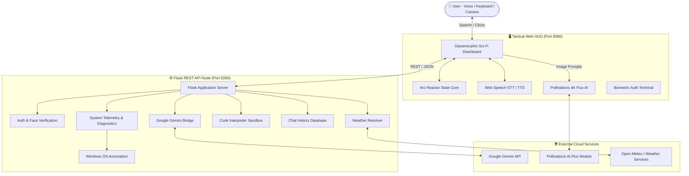

# 🏛️ J.A.R.V.I.S. AI OS — Architecture & System Design Specification

This document details the multi-tiered architecture, communication flows, component boundaries, and security design of **J.A.R.V.I.S. AI OS v3.2.0**.

---

## 🏗️ 1. High-Level Architecture Diagram

---

## 🧩 2. Core Subsystems

### 1. Web HUD Frontend
- **Technology**: Vanilla HTML5, CSS3, JavaScript (ES6+ Modules).
- **Audio Synthesis**: Hybrid Web Speech API (`SpeechSynthesisUtterance`) with automatic Devanagari / Hinglish voice routing.
- **Glassmorphism**: Backdrop blur filters, radial lighting, dynamic CSS variables bound to active theme colors (`--theme-primary`, `--theme-glow`).

### 2. Flask REST API Backend
- **Framework**: Python 3.12 Flask with Cross-Origin Resource Sharing (`flask-cors`).
- **Endpoints**:
  - `GET /` — API health check & version info.
  - `POST /api/auth/login`, `/api/auth/register`, `/api/auth/verify-otp` — Hybrid database authentication.
  - `POST /api/auth/face` — Real-time OpenCV Haar Cascade facial detection.
  - `POST /api/system/command` — Hardware diagnostic telemetry (CPU %, RAM %, CPU temp) and OS commands.
  - `GET`, `POST`, `DELETE /api/chat/history` — Conversation history management.
  - `POST /api/code/helper` — Localized Python sandbox execution.

### 3. Native Agent Tools (`actions/`)
- Encapsulated Python modules providing automation:
  - `browser_control.py`: Playwright web navigation.
  - `desktop.py`: Desktop window management and file operations.
  - `messaging.py`: Secure email and notification dispatch.
  - `system_monitor.py`: Hardware statistics polling.
  - `music.py`: OS media player controller with fallback directory resolution.
  - `weather.py`: Weather data retrieval.

---

## 🔒 3. Security & Privacy Blueprint

1. **Push Protection & Secret Hygiene**:
   - Zero hardcoded API keys in source control.
   - Configuration files (`config/api_keys.json`, `.env`) are ignored via `.gitignore` with `.example` templates provided.
2. **Biometric Face Verification**:
   - Camera frames analyzed in memory without saving raw video streams to persistent disk.
3. **Execution Sandbox**:
   - Code execution requests run within restricted subshell execution wrappers.
