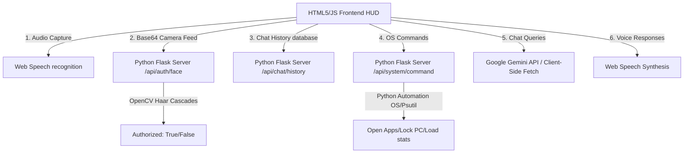

# Python Tutorial: Build a Real-Life J.A.R.V.I.S. AI Assistant

This guide explains how to build and run a fully functional, real-life **J.A.R.V.I.S. AI Assistant** with a **Python Backend** and an **HTML5/JS Frontend Dashboard**. 

This system integrates **Face Recognition (Biometric Access)**, **Voice Recognition (Speech-to-Text)**, **Vocal Synthesis (Text-to-Speech)**, **Automated Calling/Messaging overlays**, and **Gemini AI cognitive connections**. It is designed to serve as an outstanding college final-year project or a personal smart-home dashboard.

---

## 📐 Full-Stack Architecture



---

## 🛠️ Step 1: Setting Up the Python Environment

First, you need Python installed on your system (Python 3.8+ recommended).

### 1. Install Dependencies
Open your terminal/command prompt and run the following command to install the required libraries:

```bash
pip install flask flask-cors opencv-python psutil
```

*   `flask`: Light-weight web framework to build our backend API endpoints.
*   `flask-cors`: Permits our HTML5 dashboard (running on port 8080) to securely request APIs from the Python backend (running on port 5000).
*   `opencv-python`: Handles webcam image decoding and biometric facial detection.
*   `psutil`: Queries real CPU and RAM load percentages to update the dashboard.

---

## 💻 Step 2: Running J.A.R.V.I.S. Python Backend

Create or open the [server.py](file:///d:/code/html/Project/AI%20chat/Jarvis/server.py) file in your directory and execute it using Python:

```bash
python server.py
```

Upon running, you should see the following startup logs:
```text
==================================================================
 J.A.R.V.I.S. AUTOMATED COGNITIVE BACKEND SERVER                  
==================================================================
 * Port: 5000                                                     
 * Facial Biometrics: OpenCV Cascades ONLINE                      
 * Local Automation Routines: ACTIVE                              
==================================================================
 * Running on http://127.0.0.1:5000 (Press CTRL+C to quit)
```

---

## 🔗 Step 3: Connecting Frontend to Backend (App Access & History Sync)

To link the frontend dashboard to the Python server, we will update the javascript logic in `app.js` to query the Flask APIs instead of simulating them client-side.

### 1. Persistent Messages & Chat Logs
Currently, the chat logs are stored locally. To save them on the server disk database (`chat_history_db.json`), we send a POST request to the Flask server.
Add this request logic inside your Javascript messaging loops:
```javascript
// Example API query to post history logs to Python Flask
async function saveMessageToServer(sender, text, timestamp) {
    try {
        await fetch('http://127.0.0.1:5000/api/chat/history', {
            method: 'POST',
            headers: { 'Content-Type': 'application/json' },
            body: JSON.stringify({ sender, text, timestamp })
        });
    } catch (e) {
        console.warn("Python backend offline. Saving message in local storage.");
    }
}
```

### 2. Actual Facial Recognition Auth
For App Access security scan verification, the frontend webcam feeds base64 frames to the Python backend to check if a face is present:
```javascript
// Extract a frame from the lock screen video element and post it for auth
const canvas = document.createElement('canvas');
canvas.width = lockWebcamVideo.videoWidth;
canvas.height = lockWebcamVideo.videoHeight;
canvas.getContext('2d').drawImage(lockWebcamVideo, 0, 0);
const base64Frame = canvas.toDataURL('image/jpeg');

const response = await fetch('http://127.0.0.1:5000/api/auth/face', {
    method: 'POST',
    headers: { 'Content-Type': 'application/json' },
    body: JSON.stringify({ image: base64Frame })
});
const result = await response.json();
if (result.authorized) {
    // Unlock system!
}
```

---

## 📈 Step 4: Final Year College Project Submission Guide

If you are presenting this project for your college final-year project, use the following outline for your project report/thesis:

### 1. Introduction
*   **Background**: Transitioning voice command systems from simple calculators to full-featured semantic virtual assistants.
*   **Objective**: Design a responsive client-server web app modeled after Tony Stark's J.A.R.V.I.S., combining low-latency local browser voice engines with advanced AI cloud models (Gemini) and Python local automation APIs.

### 2. System Architecture
*   **Client Layer**: Standard HTML5 HUD, SVG vector visuals, CSS keyframe rings animations, and JS pipelines for speech synthesis and recognition.
*   **Server Layer**: Flask API server, handling facial biometrics via OpenCV detection cascades, persistent file-system databases, and system control automation.

### 3. Key Algorithms
*   **Speech Recognition**: Web Speech API using acoustic model mappings.
*   **Face Recognition**: Viola-Jones object detection framework (Haar Cascade classifiers) used to target facial features.
*   **Cognitive Layer**: Google Gemini LLM API (Prompt Engineering and system instructions).

### 4. Conclusion & Future Enhancements
*   Currently serves local web shortcuts, persists chats, dials holographic calls, and secures desktop apps.
*   *Future scope*: Adding actual smart-home integrations (controlling smart lights via python `requests` to smart plugs) or training a local LLM model for 100% offline intelligence.
